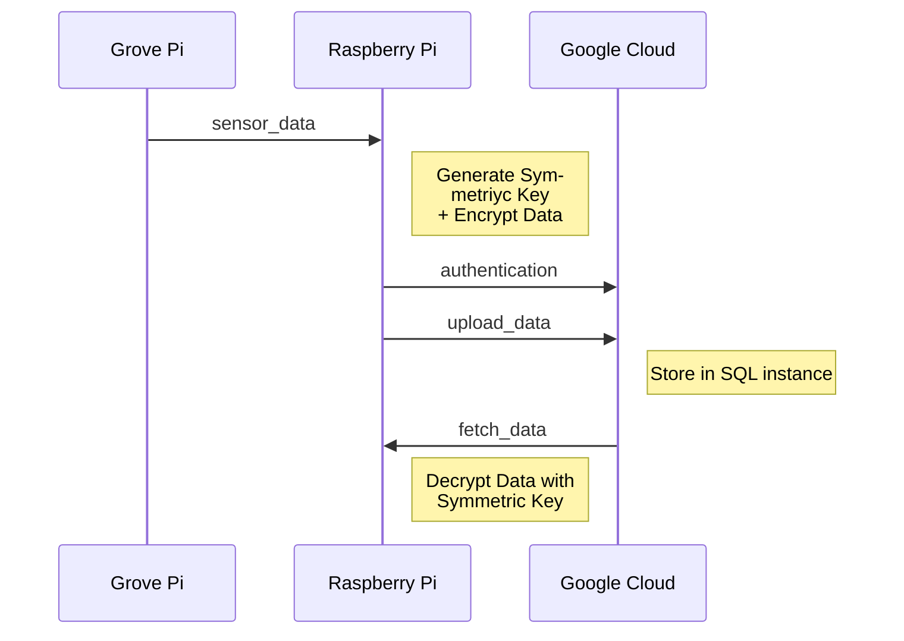
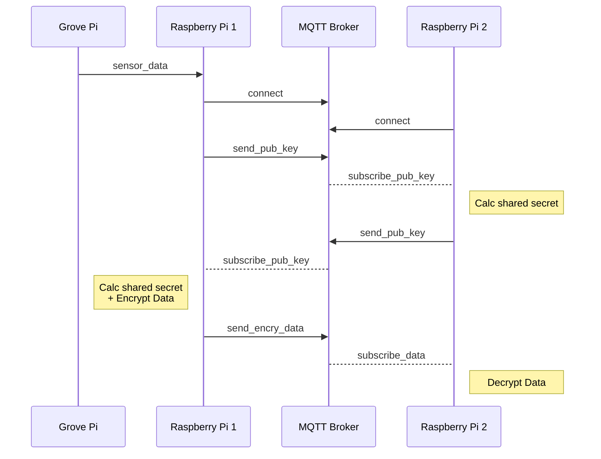

# Advanced Internet Computing :: Project_B1


> An end-to-end encrypted data storage and sharing system using Raspberry Pi's. Part of the Project Based Learning module of the Advanced Internet Computing course, SoSe, 2023.


## Group B1


- Ahmad Hawat (@cld0736) - Ahmad.hawat@tuhh.de

- Carl Egge (@cox5071) - carl.egge@tuhh.de

- Ghislain Nkamdjin Njike (@ciw0490) - ghislain.nkamdjin.njike@tuhh.de

- Mohammad Rayhanur Rahman (@ckf8282) - mohammad.rayhanur.rahman@nithh.de


**Team Coordinator:**


Mohammad Rayhanur Rahman (mohammad.rayhanur.rahman@nithh.de)

## System Architecture

This project is python based and utilizes a Flask UI. It is supposed to be run in a Set Up with a Raspberry Pi and a Grove Pi to consume real sensor data. The project is split in two parts (a Sharing and a Storage System). Explanations of the two parts can be seen at the bottom of the page. The functionality can also be run as scripts without the UI.

**Features include:**

- python grovepi package consumption of sensors
- python cryptography package used for encryption
- connection to Google Cloud using the GCP connector package
- python pyDH package used for Diffie Hellmann Key Exchange
- python paho package used for MQTT
  

## Getting Started

### Virtual Environment


In order to run the project a few python packages are needed and we want to use a virtual environment for that.

Make sure you have python and pip installed and then run:


```bash
pip  install  virtualenv
```

Next, we create the virtual environment for the project, launch it and install our requirements:


```bash
virtualenv <my_env_name>
source <my_env_name>/bin/activate
pip  install  -r  requirements.txt
```


### Run the project


The project contains a simple flask application. Be sure to install all the necessary packages in the virtual environment.


```bash
cd  src/
python3 -m flask  run
```

The project will now be served on `http://127.0.0.1:5000` and can be accessed through the browser.


### IAM Authentication to GCP


In order to connect to the Google Cloud SQL Service, we need to authenticate the process using either the gcloud SDK tools and the user credentials of the Google account or to generate a service account key with the SQL Client privilege and store the key path in the local environment. We decided to use the second option. If you want to use the Storage System, you need to set up a SQL instance and create a privileged service worker. The key of the service worker must be placed as JSON somewhere in the file system and the absolute path must be provided in the `/src/gcp/get_sql_connection.py`.


### Database Credentials

For security reasons, the credentials for the GCP SQL instance are stored in a local enviroment file (`.env`) that is not in this GitLab repository. Without the credentials from the `.env` file, it is not possible to connect to the SQL instance. Set Up the `.env` file in the following format and fill in your information:

    db_user = <root>
    db_pass = <your-password>
    db_name = <test>
    project_id = <project-id>
    region = <region>
    instance_name = <test-instance>

### MQTT Broker

For the second part of the project (Sharing System) you will need two clients that can connect through the network. One client must run a MQTT Broker. See [here](https://collaborating.tuhh.de/e-19/teaching/project_b1/-/wikis/Mqtt-setup) for the installation and setup and  [here](https://mosquitto.org/man/mosquitto-8.html) for more information. 

To connect to the mqtt Broker you need to install the python library paho-mqtt on both devices using the `pip install paho-mqtt` command.
It is important to specify the IP address of the broker and the port number also in the `.env` file like so:

    broker_address = <your-ip-here>
    port = 1883

The receiving client should start the `script_client_share_data.py`. This will allow the Raspberry Pi to connect and exchange encrypted data.

## Data Storage System

The storage system will involve acquiring streaming data from the sensors, encrypting them in batches and storing them in the Google Cloud.



## Data Sharing System

The sharing system should enable end-to-end encrypted peer-to-peer data transmission between two parties.




## Helpful Links

**Google Cloud:**

- [Service Account Authentication](https://cloud.google.com/iam/docs/keys-create-delete)

**Flask:**

- [Official Documentation](https://flask.palletsprojects.com/en/2.3.x/)

- [Dynamically Update UI with Flask Turbo](https://blog.miguelgrinberg.com/post/dynamically-update-your-flask-web-pages-using-turbo-flask)

**MQTT:**

- [mosquitto docs](https://mosquitto.org/man/mosquitto-8.html)
